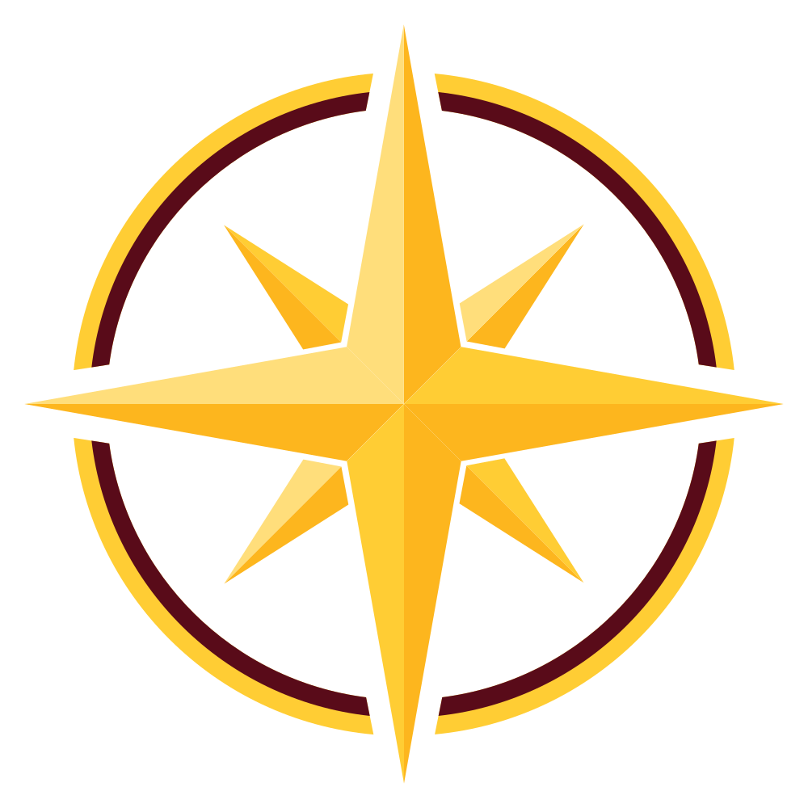

  

  # Northstar Advanced Robotics

 

## Welcome

Whether you just joined the team or your a veteran member, this page is your map to everything we build in software. Below are our core repositories.

New members: start with **Resources** to get your dev environment set up, then head into whichever subteam repo matches where you're contributing.
 

## Repositories

<table>
  <tr>
    <td width="90"><strong>🛠️</strong></td>
    <td>
      <a href="https://github.com/Northstar-Advanced-Robotics/resources"><strong>resources</strong></a>
       
      Setup guides, onboarding docs, and shared tooling/CI configs. If you're new or setting up a fresh machine, this is repo #1.
    </td>
  </tr>
  <tr>
    <td><strong>🦾</strong></td>
    <td>
      <a href="https://github.com/Northstar-Advanced-Robotics/northstar-robomaster"><strong>northstar-robomaster</strong></a>
       
      Controls code for our RoboMaster competition robots — embedded firmware, motion control, and chassis/gimbal logic.
    </td>
  </tr>
  <tr>
    <td><strong>🤖</strong></td>
    <td>
      <a href="https://github.com/Northstar-Advanced-Robotics/northstar_sentry_ros"><strong>northstar_sentry_ros</strong></a>
       
      ROS-based software stack for our Sentry robot — autonomy, navigation, and system integration.
    </td>
  </tr>
  <tr>
    <td><strong>👁️</strong></td>
    <td>
      <a href="https://github.com/Northstar-Advanced-Robotics/Northstar-CV"><strong>Northstar-CV</strong></a>
       
      Computer vision pipeline — target detection, tracking, and aiming for our robots.
    </td>
  </tr>
</table>

 

## Getting Started

1. Read through [`resources`](https://github.com/Northstar-Advanced-Robotics/resources) and follow the setup guide for your subteam.
2. Clone the repo(s) for the subteam(s) you're working on.
3. Ask if you get stuck, someone's been stuck there before you.

 

  Northstar Advanced Robotics

